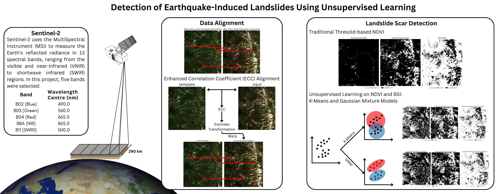
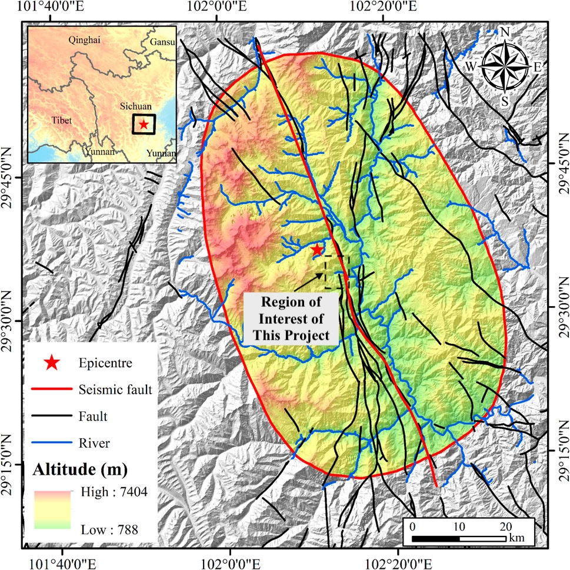
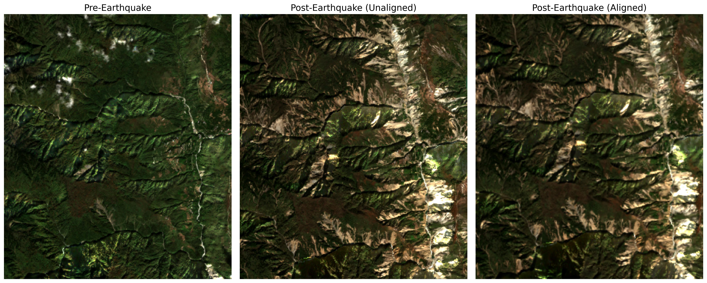
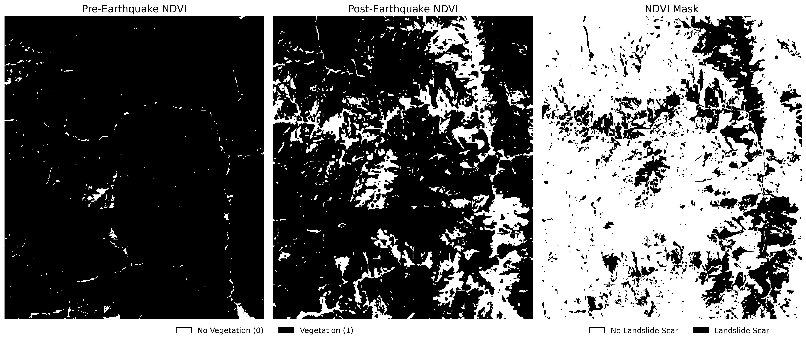
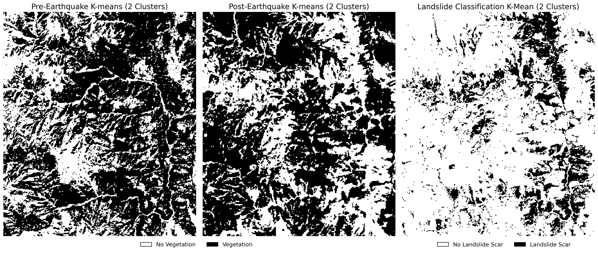
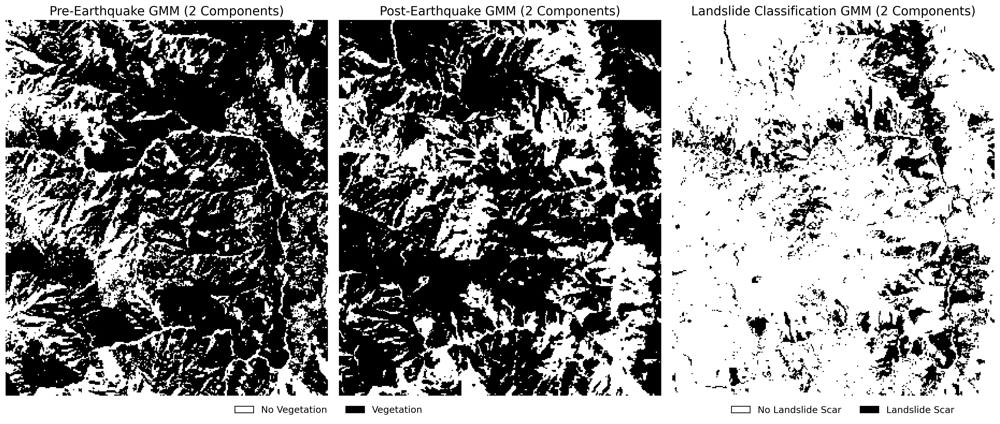
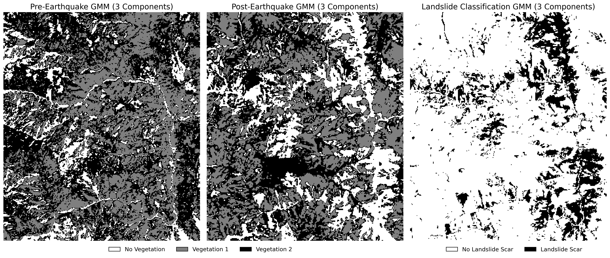
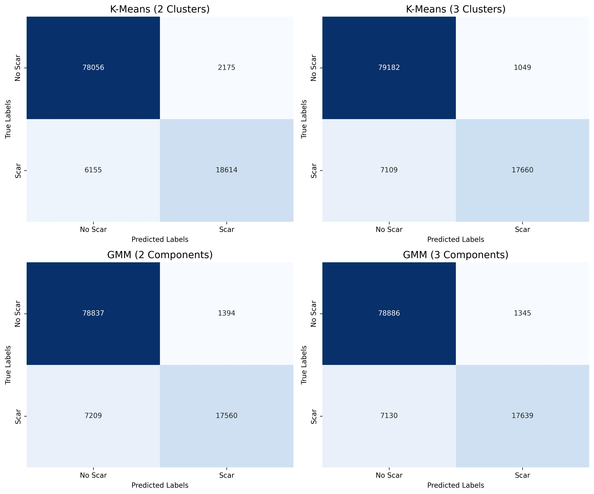
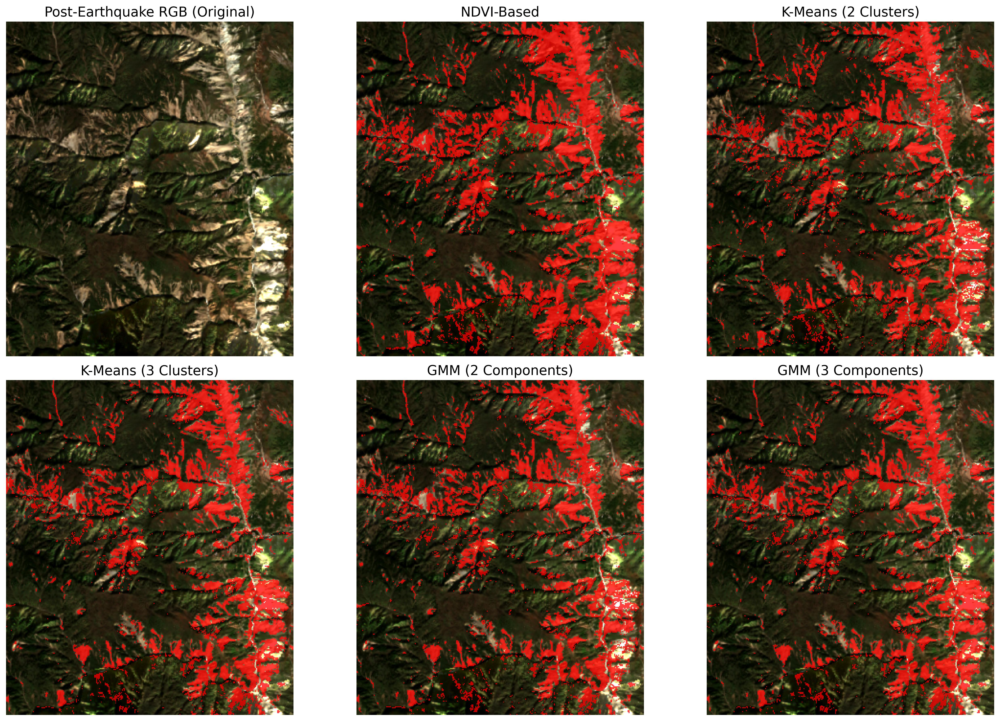

# Detection of Earthquake-Induced Landslides Using Unsupervised Learning

<div align="center">
  <figure>
  <br>
  </figure>
</div>
<br>

<details>
  <summary><b>Table of Contents</b></summary>
  
- [About The Project](#about-the-project)
  - [Background](#background)
  - [Study Area and Date](#study-area-and-date)
- [Getting Started](#getting-started)
  - [Prerequisite](#prerequisite)
  - [Sentinel-2 Data](#sentinel-2-data)
- [Data Alignment](#data-alignment)
- [Normalised Difference Vegetation Index (NDVI) Mask](#normalised-difference-vegetation-index-ndvi-mask)
- [Unsupervised Learning](#unsupervised-learning)
  - [Bare Soil Index (BSI)](#bare-soil-index-bsi) 
  - [K-Means](#k-means)
  - [Gaussian Mixture Models (GMM)](#gaussian-mixture-models-gmm)
- [Performance Analysis](#performance-analysis)
- [Conclusion](#conclusion)
- [Environmental Cost Assessment](#environmental-cost-assessment)
- [Video Tutorial](#video-tutorial)
- [References](#references)
- [Contact](#contact)
</details>

<p align="right">(<a href="#top">back to top</a>)</p>

## About The Project
This project is the final assignment for GEOL0069: Artificial Intelligence for Earth Observation. It explores the use of unsupervised learning methods, specifically K-means and Gaussian Mixture Models, to identify landslide scars using Sentinel-2 optical imagery acquired before and after an earthquake. The complete code implementation for this project is available in the file Final_Project.ipynb.

### Background
Landslides are significant natural hazards, often triggered by seismic events or heavy rainfall, that can damage infrastructure and cause casualties. Therefore, rapid and reliable detection of landslide-affected areas is critical for post-disaster assessment. Moreover, landslide scars can offer valuable insight for developing hydrogeological models to assess slope stability (Montgomery & Dietrich, 1994). Satellite remote sensing enables observation over large-scale and inaccessible regions, with optical sensors providing spectral information useful for detecting vegetation loss and surface disturbance. In particular, data from the Sentinel-2 satellite mission, which offers high-resolution multispectral imagery, is well suited for landslide mapping.

<div align="center">
  <figure>
  <br>
  <figcaption style="text-align:center;">The location of the 2022 Luding earthquake and the region of interest of this study. The map is retrieved from Ding and Wang (2025).</figcaption>
  </figure>
</div>
<br>

On 5 September 2022, an Mw 6.6 shallow left-lateral earthquake struck Luding, China, triggering over 5,000 landslides (Ding and Wang, 2025). Despite the stress release along the Xianshuihe Fault caused by the Luding earthquake, historical records suggest that the southern Anninghe Fault still poses a significant seismic hazard (Wen et al., 2008). Consequently, it is important to assess the landslide hazard in the surrounding region. This project focuses on a mountainside area southeast of the epicentre, where landslides were densely concentrated. The selected site also benefits from minimal cloud coverage in both pre- and post-earthquake Sentinel-2 images, providing favourable conditions for conducting this analysis.

A widely used approach for landslide scar detection via remote sensing is the Normalised Difference Vegetation Index (NDVI) (Kriegler et al., 1969). 

$$
\text{NDVI} = \frac{\text{NIR} - \text{Red}}{\text{NIR} + \text{Red}}
$$

Since healthy vegetation strongly reflects near-infrared radiation and absorbs red light, NDVI uses these spectral bands to quantify vegetation density. Analysing changes in NDVI before and after the earthquake enables preliminary identification of landslide-affected areas (e.g., Saito et al., 2022; Yunus et al., 2020). However, because vegetation reflectance varies with local conditions, the traditional threshold-based NDVI method requires prior knowledge of vegetation characteristics (Yang et al., 2019). To address this limitation, this study applies unsupervised learning using K-means and Gaussian Mixture Models as an exploratory approach to evaluate whether artificial intelligence can reliably detect landslide scars without prior knowledge of the local environment.

### Study Area & Date
A 300 m × 350 m rectangular region located southeast of the epicentre (29.59°N, 102.08°E).
To minimise the seasonal differences in vegetation and ensure low cloud coverage, the following dates were selected:
- 05/11/2021
- 20/11/2022

<div align="center">
  <figure>
  <br>
  <figcaption style="text-align:center;">RGB images of the region of interest before and after the 2022 Luding earthquake.</figcaption>
  </figure>
</div>
<br>

<p align="right">(<a href="#top">back to top</a>)</p>

## Getting Started
This project was conducted on Google Colab, which provides free GPU access and allows storage via Google Drive. Alternatively, you may run it in a local environment, but this requires installing the necessary packages and ensuring sufficient computational resources.
### Prerequisite
To read, write, and analyse geospatial raster data, the rasterio package must be installed in Google Colab using the code below before beginning the project. To estimate the carbon emission of this project, the package codecarbon will also need to be installed.
```python
!pip install rasterio
!pip install codecarbon
```
The package should then be imported along with the other required libraries. For a complete list of packages, please refer to Final_Project.ipynb. If you are running the code locally, ensure all required packages are properly installed.

### Sentinel-2 Data
Sentinel-2 is a satellite mission developed by the European Space Agency (ESA) under the Copernicus Programme, designed to provide high-resolution optical imagery for land monitoring. It captures data in 13 spectral bands ranging from visible to shortwave infrared, with spatial resolutions of 10, 20, and 60 metres depending on the band. This study uses Level-2A (L2A) products, which provide bottom-of-atmosphere (BOA) reflectance data derived from Level-1C top-of-atmosphere (TOA) imagery through atmospheric correction (European Space Agency, n.d.). Since this project requires the shortwave infrared (SWIR) bands, which are not available at 10-metre resolution, all bands were processed at 20-metre resolution to ensure consistency.

<div align="center">
  <table>
    <caption style="text-align:center; font-weight:bold;">Sentinel-2 Bands Used in This Project</caption>
    <tr>
      <th style="text-align:center;">Band</th>
      <th style="text-align:center;">Name</th>
      <th style="text-align:center;">Central Wavelength (nm)</th>
      <th style="text-align:center;">Resolution</th>
      <th style="text-align:center;">Use</th>
    </tr>
    <tr>
      <td style="text-align:center;">B02</td>
      <td style="text-align:center;">Blue</td>
      <td style="text-align:center;">490</td>
      <td style="text-align:center;">20 m</td>
      <td style="text-align:center;">Use in RGB and BSI</td>
    </tr>
    <tr>
      <td style="text-align:center;">B03</td>
      <td style="text-align:center;">Green</td>
      <td style="text-align:center;">560</td>
      <td style="text-align:center;">20 m</td>
      <td style="text-align:center;">Use in RGB</td>
    </tr>
    <tr>
      <td style="text-align:center;">B04</td>
      <td style="text-align:center;">Red</td>
      <td style="text-align:center;">665</td>
      <td style="text-align:center;">20 m</td>
      <td style="text-align:center;">Use in RGB, NDVI, and BSI</td>
    </tr>
    <tr>
      <td style="text-align:center;">B8A</td>
      <td style="text-align:center;">NIR</td>
      <td style="text-align:center;">865</td>
      <td style="text-align:center;">20 m</td>
      <td style="text-align:center;">Use in NDVI</td>
    </tr>
    <tr>
      <td style="text-align:center;">B11</td>
      <td style="text-align:center;">SWIR</td>
      <td style="text-align:center;">1610</td>
      <td style="text-align:center;">20 m</td>
      <td style="text-align:center;">Use in BSI</td>
    </tr>
  </table>
</div>


To fetch the data, you must create an account on the Copernicus Open Access Hub and input your login credentials in the "Fetching Data" section of the code.

```python
# --- Authenticate with Copernicus Data Space ---
username = "your_username"
password = "your_password"
access_token, refresh_token = get_access_and_refresh_token(username, password)

# --- Define Time Ranges for Pre- and Post-earthquake ---
pre_eq_start_date = "2021-11-05"
pre_eq_end_date = "2021-11-06"
post_eq_start_date = "2022-11-20"
post_eq_end_date = "2022-11-21"

# --- Query Sentinel-2 Products Covering 2022 Luding Earthquake Affected Area ---
pre_eq_sentinel2_data = query_sentinel2_luding_data(
    pre_eq_start_date, pre_eq_end_date, access_token
)

post_eq_sentinel2_data = query_sentinel2_luding_data(
    post_eq_start_date, post_eq_end_date, access_token
)

# --- Download the Selected Sentinel-2 Product for Each Time Range ---
download_dir = "/content/drive/MyDrive/GEOL0069_AI4EO/Final_Project/"  # Define download directory

# Download Pre-Earthquake Product
product_id = pre_eq_sentinel2_data['Id'][0]
file_name = pre_eq_sentinel2_data['Name'][0]
download_single_product(product_id, file_name, access_token, download_dir)

# Download Post-Earthquake Product
product_id = post_eq_sentinel2_data['Id'][0]
file_name = post_eq_sentinel2_data['Name'][0]
download_single_product(product_id, file_name, access_token, download_dir)
```
The downloaded file will be in ZIP format. To access the data, unzip the file in the directory where it was saved.

<p align="right">(<a href="#top">back to top</a>)</p>

## Data Alignment
The Sentinel-2 images used in this study exhibited spatial misalignment, particularly when comparing pre- and post-event scenes. These discrepancies can affect pixel-level correspondence and must be corrected through image registration or coregistration techniques to ensure reliable change detection. Therefore, Enhanced Correlation Coefficient (ECC) alignment (Evangelidis & Psarakis, 2008) was applied to the post-earthquake image, using the pre-earthquake image as the reference. The alignment result is shown below:

<div align="center">
  <figure>  
  <br>
  <figcaption style="text-align:center;">The pre-earthquake, unaligned post-earthquake, and aligned post-earthquake RGB images for the region of interest in this study.</figcaption>
  </figure>
</div>
<br>

<p align="right">(<a href="#top">back to top</a>)</p>

## Normalised Difference Vegetation Index (NDVI) Mask
After aligning the pre- and post-earthquake images, a ground truth was defined using a traditional threshold-based NDVI method. Areas with a decrease in NDVI greater than 0.2 (i.e. $\Delta NDVI < –0.2$ ), indicating vegetation loss, were identified and used to generate a landslide scar mask.

<p align="center">
  
  <figcaption style="text-align:center;">The NDVI of pre-earthquake and aligned post-earthquake and the NDVI mask.</figcaption>
</p>

<p align="right">(<a href="#top">back to top</a>)</p>

## Unsupervised Learning
Since using raw band data to detect landslide scars produced unsatisfactory results, and given that this project aims to eliminate the need for predefined thresholds in traditional methods, NDVI and another index, the Bare Soil Index (BSI), were retained as input features for the unsupervised learning approach instead of being replaced by raw band values.

### Bare Soil Index (BSI)
Since bare soil typically reflects more light in the red and blue bands than vegetated areas, and exhibits strong reflectance in the SWIR region while showing low reflectance in the NIR region, combining these spectral characteristics helps identify the presence of bare soil (Roy et al., 1996).

$$
\text{BSI} = \frac{(\text{SWIR} + \text{Red}) - (\text{NIR} + \text{Blue})}{(\text{SWIR} + \text{Red}) + (\text{NIR} + \text{Blue})}
$$

### K-Means
K-means clustering is an unsupervised learning algorithm that partitions a dataset into k predefined clusters based on feature similarity (MacQueen, 1967). The algorithm assigns each data point to the nearest centroid, aiming to minimise within-cluster variance. In this project, K-means clustering was applied to differentiate landslide scars from non-affected areas based on NDVI and BSI indices derived from pre- and post-earthquake Sentinel-2 imagery. Two scenarios were examined: clustering with two and three clusters, respectively. This approach was used to assess whether adding an extra cluster improves performance, particularly by reducing misclassification of vegetation with varying reflectance as bare soil.

<div align="center">
  <figure>  
  <br>
  <figcaption style="text-align:center;">Landslide scar detection using K-means clustering with two clusters.</figcaption>
  </figure>
</div>
<br>
<div align="center">
  <figure>  
  <br>
  <figcaption style="text-align:center;">Landslide scar detection using K-means clustering with three clusters.</figcaption>
  </figure>
</div>
<br>

### Gaussian Mixture Models (GMM)
Gaussian Mixture Models (GMMs) are probabilistic models that represent normally distributed subpopulations within an overall population. The model assumes that the data is generated from a mixture of several Gaussian distributions, each with its own mean and variance (Reynolds, 2009). GMMs are widely used for clustering and density estimation, as they provide a method for representing complex distributions by combining simpler ones. Similar to K-means, GMM clustering was applied with two and three components to evaluate whether increasing the number of components improves classification performance, particularly in distinguishing landslide scars from non-affected areas based on NDVI and BSI indices derived from Sentinel-2 imagery.

<div align="center">
  <figure>  
  <br>
  <figcaption style="text-align:center;">Landslide scar detection using Gaussian Mixture Model (GMM) clustering with two components.</figcaption>
  </figure>
</div>
<br>
<div align="center">
  <figure>  
  <br>
  <figcaption style="text-align:center;">Landslide scar detection using Gaussian Mixture Model (GMM) clustering with three components.</figcaption>
  </figure>
</div>
<br>

<p align="right">(<a href="#top">back to top</a>)</p>

## Performance Analysis
To analyse the performance of the four models, the NDVI-derived landslide mask was used as a reference for evaluating the classification results from the K-means and Gaussian Mixture Model (GMM) methods. Confusion matrices were computed to assess agreement between the model predictions and the reference. Additional performance metrics, including accuracy scores and classification reports, are provided in the code. Finally, all predicted masks were overlaid on the post-earthquake true-colour image to enable visual comparison of detection performance.

<div align="center">
  <figure>  
  <br>
  <figcaption style="text-align:center;">Confusion matrices for all models.</figcaption>
  </figure>
</div>
<br>
<div align="center">
  <figure>  
  <br>
  <figcaption style="text-align:center;">Post-earthquake true-colour imagery and classification overlays. The six panels include: (1) the original post-earthquake true-colour image, (2) the NDVI-derived landslide mask, (3) K-means clustering with two clusters, (4) K-means with three clusters, (5) Gaussian Mixture Model (GMM) with two components, and (6) GMM with three components.</figcaption>
  </figure>
</div>

<p align="right">(<a href="#top">back to top</a>)</p>

## Conclusion
The model results show that, in terms of distinguishing vegetation and bare soil, using three clusters for K-means and three components for GMM yields significantly better performance. However, when comparing the pre- and post-earthquake classifications for landslide scar detection, all models perform similarly, each achieving an accuracy score above 0.9. This high level of accuracy suggests that unsupervised learning could be a viable approach for rapidly and reliably detecting landslide scars without requiring prior knowledge of local vegetation characteristics, as is needed in traditional threshold-based methods. Therefore, the number of clusters or components can be selected based on the specific objective of the study: for landslide scar detection using multi-temporal imagery, two clusters or components are sufficient; for distinguishing vegetation and bare soil from a single-date image, three clusters or components are recommended to improve classification accuracy.
<p align="right">(<a href="#top">back to top</a>)</p>

## Environmental Cost Assessment
To estimate the carbon footprint of this project, the codecarbon package was implemented at the beginning of the workflow to track energy consumption throughout each step. Based on the estimation:

- 5.8 g of carbon dioxide (CO2) was emitted
- 0.009029 kWh of electricity was consumed

According to Greenhouse Gas Reporting: Conversion Factors 2022 (Department for Energy Security and Net Zero & Department for Business, Energy & Industrial Strategy, 2022), a petrol car emits approximately 170 g CO2 per kilometre, while a domestic flight emits about 246 g CO2 per kilometre. The low emissions of this project may be attributed to its relatively low computational demand and the use of a CPU-based runtime in Google Colab. However, as the estimate is based on a single execution of the final code, it likely underrepresents the total environmental cost incurred during the development process. Accounting for trial-and-error iterations, a rough estimate assumes 30 times the energy consumption, resulting in approximately 174 g of CO2. An additional source of indirect energy use in this project is the use of ChatGPT, as AI tools are permitted for assistive tasks in this module. ChatGPT was used for debugging code and refining the grammar of this README file. Nevertheless, compared to the emissions associated with traditional field-based measurements, the use of remote sensing and artificial intelligence offers a significantly lower-carbon alternative for landslide mapping and analysis.
<p align="right">(<a href="#top">back to top</a>)</p>

## Video Tutorial
<p align="right">(<a href="#top">back to top</a>)</p>

## References
Department for Energy Security and Net Zero & Department for Business, Energy & Industrial Strategy. (2022, September 20). Greenhouse gas reporting: Conversion factors 2022. GOV.UK. https://www.gov.uk/government/publications/greenhouse-gas-reporting-conversion-factors-2022

Ding, Z., & Wang, C. (2025). Coseismic landslides caused by the 2022 Luding earthquake in China: Insights from remote sensing interpretations and machine learning models. Frontiers in Earth Science, 13, 1564744. https://doi.org/10.3389/feart.2025.1564744

European Space Agency. (n.d.). SENTINEL-2 Documents. SentiWiki. https://sentiwiki.copernicus.eu/web/document-library#Library-S2-Documents

Evangelidis, G. D., & Psarakis, E. Z. (2008). Parametric Image Alignment Using Enhanced Correlation Coefficient Maximization. IEEE Transactions on Pattern Analysis and Machine Intelligence, 30(10), 1858–1865. https://doi.org/10.1109/TPAMI.2008.113

Kriegler, F., Malila, W., Nalepka, R., & Richardson, W. (1969). Preprocessing transformations and their effect on multispectral recognition. Proceedings of the 6th International Symposium on Remote Sensing of Environment. Ann Arbor, MI: University of Michigan, 97-131.

MacQueen, J. (1967). Some methods for classification and analysis of multivariate observations. In Proceedings of the Fifth Berkeley Symposium on Mathematical Statistics and Probability, Volume 1: Statistics: Vol. 5.1 (pp. 281–298). University of California Press. https://projecteuclid.org/ebooks/berkeley-symposium-on-mathematical-statistics-and-probability/Proceedings-of-the-Fifth-Berkeley-Symposium-on-Mathematical-Statistics-and/chapter/Some-methods-for-classification-and-analysis-of-multivariate-observations/bsmsp/1200512992

Montgomery, D. R., & Dietrich, W. E. (1994). A physically based model for the topographic control on shallow landsliding. Water Resources Research, 30(4), 1153–1171. https://doi.org/10.1029/93WR02979

Reynolds, D. (2009). Gaussian Mixture Models. In S. Z. Li & A. Jain (Eds.), Encyclopedia of Biometrics (pp. 659–663). Springer US. https://doi.org/10.1007/978-0-387-73003-5_196

Roy, P. S., Sharma, K. P., & Jain, A. (1996). Stratification of density in dry deciduous forest using satellite remote sensing digital data—An approach based on spectral indices. Journal of Biosciences, 21(5), 723–734. https://doi.org/10.1007/BF02703148

Saito, H., Uchiyama, S., & Teshirogi, K. (2022). Rapid vegetation recovery at landslide scars detected by multitemporal high-resolution satellite imagery at Aso volcano, Japan. Geomorphology, 398, 107989. https://doi.org/10.1016/j.geomorph.2021.107989

Wen, X., Ma, S., Xu, X., & He, Y. (2008). Historical pattern and behavior of earthquake ruptures along the eastern boundary of the Sichuan-Yunnan faulted-block, southwestern China. Physics of the Earth and Planetary Interiors, 168(1), 16–36. https://doi.org/10.1016/j.pepi.2008.04.013

Yang, W., Wang, Y., Sun, S., Wang, Y., & Ma, C. (2019). Using Sentinel-2 time series to detect slope movement before the Jinsha River landslide. Landslides, 16(7), 1313–1324. https://doi.org/10.1007/s10346-019-01178-8

Yunus, A. P., Fan, X., Tang, X., Jie, D., Xu, Q., & Huang, R. (2020). Decadal vegetation succession from MODIS reveals the spatio-temporal evolution of post-seismic landsliding after the 2008 Wenchuan earthquake. Remote Sensing of Environment, 236, 111476. https://doi.org/10.1016/j.rse.2019.111476

<p align="right">(<a href="#top">back to top</a>)</p>

## Contact
Po Wang Lam - po.lam.24@ucl.ac.uk

<p align="right">(<a href="#top">back to top</a>)</p>
