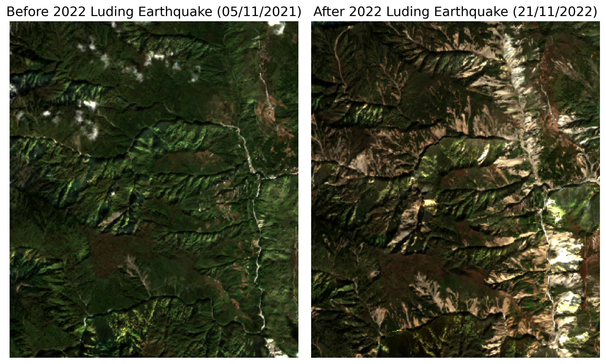

# Earthquake-Induced Landslides Detection Using Unsupervised Learning

  

(<a href="#top">back to top</a>)

## About The Project
This project is the final assignment for GEOL0069: Artificial Intelligence for Earth Observation. It explores the use of unsupervised learning methods, specifically K-means and Gaussian Mixture Models, to identify landslide scars using Sentinel-2 optical imagery acquired before and after an earthquake. The complete code implementation for this project is available in the file Final_Project.ipynb.

### Background

  
<b>Table of Contents</b>

  
- [About The Project](#about-the-project)
  - [Background](#background) 
- [Getting Started](#getting-started)
  - [Prerequisite](#prerequisite)
  - [Sentinel-2 Data](#sentinel-2-data)
- [Data Alignment](#data-alignment)
- [Normalised Difference Vegetation Index (NDVI) Mask](#ndvi-mask)
- [Unsupervised Learning](#unsupervised-learning)
  - [Bare Soil Index (BSI)](#bsi) 
  - [K-Means](#k-mean)
  - [Gaussian Mixture Models (GMM)](#gaussian-mixture-models-gmm)
- [Performance Analysis](#performance-anaylsis)
- [Conclusion](#conclusion)
- [Environmental Cost Assessment](#environmental-cost-assessment)
- [Video Tutorial](#video-tutorial)
- [References](#references)
- [Contact](#contact)

